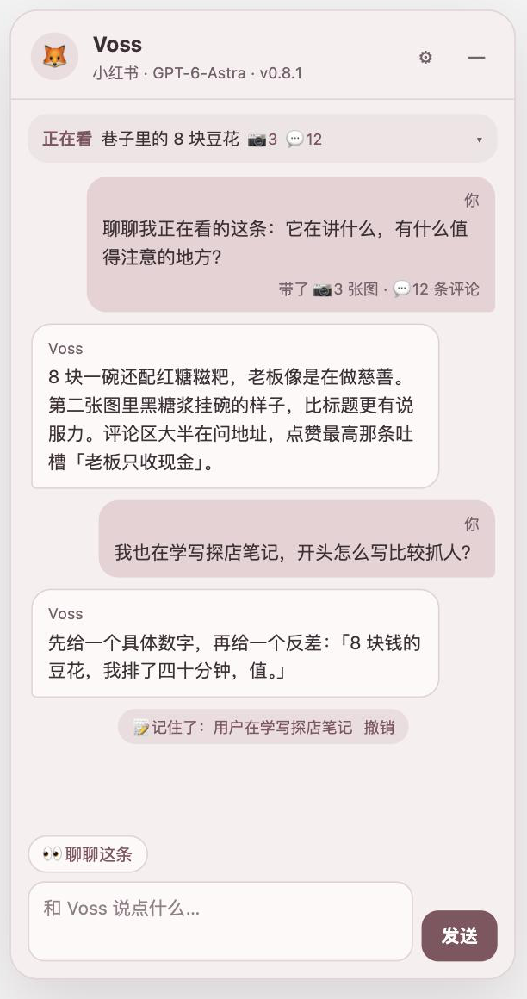

# Voss Scroll 🦊

在 Mac 的 Chrome 里刷小红书、抖音时，网页右边会有一只狐狸陪你聊天。

它会看你正在看的笔记（文字、图片、评论），会接着上一句聊，也会慢慢记住你。回复用的是**你自己的 ChatGPT 订阅额度**：扩展通过你电脑上的 Codex 去问模型，不需要 API key。

<p align="center"></p>
<p align="center"><sub>截图里的笔记和对话都是演示用的模拟内容。</sub></p>

> 这是个人项目，不是 OpenAI、小红书或抖音的官方产品，也和它们没有任何关系。

## 能做什么

- **陪你聊天**：侧栏就是一个聊天窗口，可以连续追问，聊天记录存在你自己的电脑上。
- **聊聊这条**：点「👀 聊聊这条」，把当前笔记的标题、作者、正文、最多 6 张图片和已加载的评论发给 Voss。自己打字发的消息是纯文字，不带笔记。
- **长期记忆**：Voss 会从聊天里记下关于你的事，比如偏好、正在做的事；回复下面会出现「📝 记住了：…」，可以撤销。在设置里能看到、删掉每一条，也可以直接说「忘掉……」。
- **人设**：默认是一只友好、好奇、有点调皮的狐狸。性格写在 [`bridge/persona.mjs`](bridge/persona.mjs) 里，改这个文件就能给它你想要的语气（改完在 `chrome://extensions` 重新加载扩展）。
- **可以自定义**：模型、思考深度、四套低饱和配色（雾粉 / 雾蓝 / 鼠尾草绿 / 杏橙）、名字和头像。

## 它怎么工作

```
小红书 / 抖音网页
  └─ Chrome 扩展（extension/）：侧栏界面、读当前笔记
       └─ Chrome Native Messaging
            └─ 本机桥接（bridge/，Node.js）：检查请求、组装提示词
                 └─ Codex app-server（你电脑上的 Codex，用你的 ChatGPT 登录）
                      └─ 模型回复沿原路回到侧栏
```

每次回复都会临时启动一次 Codex，用完就关，临时文件也会删掉。Codex 里的工具、文件读写、联网、插件都被关掉了，Voss 只能「看」和「说」。

## 你需要

- **macOS** 和 **Google Chrome**（目前只支持这个组合）
- **Node.js 20 或更新版本**
- **Codex**，并用 **ChatGPT 账号**登录（需要订阅，额度按你的套餐计算）
  - 默认使用 ChatGPT 桌面版里自带的 Codex：`/Applications/ChatGPT.app/Contents/Resources/codex`
  - 只装了 Codex 命令行版也可以，安装器会自动找到终端里的 `codex`，或者用 `--codex /完整路径` 指定

## 安装

1. **下载这个仓库**，放在一个以后不会移动的位置。
2. **检查 Codex**（只检查登录和连接，不花额度）：
   ```bash
   node bridge/check-connection.mjs
   ```
   看到 `"readyForModelTest": true` 就可以继续。
3. **加载扩展**：打开 `chrome://extensions`，开启右上角「开发者模式」，点「加载已解压的扩展程序」，选择本仓库里的 **`extension`** 文件夹。记下卡片上显示的**扩展 ID**（32 个小写字母）。
4. **安装本机桥接**，把 `你的扩展ID` 换成上一步的 ID：
   ```bash
   node bridge/install-native-host.mjs 你的扩展ID --install
   ```
   它会：
   - 在 `bridge/` 里生成一个启动脚本，记下 Node 和 Codex 的完整路径（Chrome 启动本机程序时找不到你终端里的命令，所以要提前记下）；
   - 在 `~/Library/Application Support/Google/Chrome/NativeMessagingHosts/` 写一个配置文件，只允许你这个扩展 ID 调用。

   输出里的 `"codex"` 会显示用的是哪个 Codex。它不会写入 API key，也不会改 Codex 的全局设置。
5. **打开小红书或抖音**（已经打开的页面要刷新一下），右边应该会出现 Voss。

> 移动了仓库位置，或者扩展 ID 变了，都要重新运行第 4 步。

## 使用

- **聊聊这条**：打开一篇笔记，点「👀 聊聊这条」。想让 Voss 看到更多评论，先在页面上往下滚、点开「展开 N 条回复」。
- **直接聊天**：在下面的输入框里打字，回车发送，Shift + 回车换行。等待回复时「发送」会变成「停止」。
- **设置**：点右上角 ⚙︎。
  - 外观：配色、名字、头像
  - 模型：模型和思考深度（越深越慢，也越耗额度）
  - 看图与记忆：两个开关、记住的事、你写给 Voss 的背景
  - 聊天记录：新聊天、打开旧聊天、导出

## 隐私：会发送什么

所有聊天记录、记忆和设置都只存在你电脑的 Chrome 里（`chrome.storage.local`）。只有在你发消息时，下面这些内容才会经 Codex 发给 OpenAI 的模型：

| 什么时候 | 发送的内容 |
|---|---|
| 每条消息 | 你这句话、最近的聊天记录（最多 24 条，包括之前分享过的笔记摘要）、你写的背景、Voss 记住的事、你给它起的名字 |
| 只在点「聊聊这条」时 | 当前笔记的标题、作者、正文；最多 6 张图片（缩到约 1024px，可在设置里关掉）；已加载的评论，最多 20 条 |

**不会发送**：Cookie、登录信息、网页地址、页面上的其他内容、评论者的用户名、头像、日期和 IP 属地。

项目本身不收集任何数据，也没有统计代码。卸载扩展会清掉本地的聊天记录，卸载前可以先在设置里「导出」。

## 额度

- 每条回复都用你 ChatGPT 套餐里的 Codex 额度。**带图片的消息明显更耗额度**，不需要时可以在设置里关掉看图。
- 额度用完时侧栏会提示「Codex 额度不足」，等额度恢复就能继续用。
- 点了「停止」只能停止本机的等待，已经发到服务器的请求可能仍然会计入额度。

## 已知限制

- 只支持 **macOS + Google Chrome**；Chromium、Edge、Arc、Brave 的本机桥接配置位置不同，还没适配。
- 依赖 Codex 的 **app-server 接口**，它目前标记为实验性功能，ChatGPT App 或 Codex 更新后可能需要改代码。
- 小红书、抖音改版后，页面读取可能失效，需要更新 [`extension/sites/`](extension/sites/) 里的规则。
- **抖音**目前只读文字，不看视频画面，也没有在真实页面上充分测试过。
- 只能读到页面上**已经加载出来**的评论。
- 模型只看文字和图片，**看不到视频**。

## 常见问题

**侧栏说「扩展刚更新过……请刷新页面」**
重新加载扩展后，已经打开的网页要刷新（Cmd + R）才能连上新版本。

**侧栏说「扩展后台没有响应」或「本机分析连接尚未就绪」**
确认完成了安装第 4 步，而且扩展 ID 和安装时填的一致；然后在 `chrome://extensions` 重新加载扩展，再刷新网页。

**提示「无法启动本机 Codex」**
Chrome 找不到 Codex。在终端运行 `which codex` 查到完整路径，然后重新安装本机桥接：
```bash
node bridge/install-native-host.mjs 你的扩展ID --install --codex /完整路径/codex
```

**提示「请在 Codex 中登录 ChatGPT」**
打开 Codex 用 ChatGPT 账号重新登录，然后运行 `node bridge/check-connection.mjs` 确认。

**卸载**
在 `chrome://extensions` 移除扩展，再删除 `~/Library/Application Support/Google/Chrome/NativeMessagingHosts/com.voss.scroll.json`。

## 开发

- **离线测试**：不启动真实 Codex，不花额度。
  ```bash
  npm test
  ```
- **浏览器测试**：
  1. 在仓库根目录运行 `python3 -m http.server 8765`；
  2. 用 Chrome 打开 `http://localhost:8765/tests/chat-browser.html?assume-visible` 和 `http://localhost:8765/tests/browser.html?assume-visible`；
  3. 页面标题会显示 PASS / FAIL 数量。
- **真实模型测试**（会花一点额度）：`node bridge/smoke-test.mjs`。

主要文件：

| 位置 | 作用 |
|---|---|
| `extension/panel.js`、`style.css` | 侧栏界面和配色 |
| `extension/content.js` | 读网页、发送消息 |
| `extension/sites/` | 小红书、抖音的页面读取规则 |
| `extension/background.js`、`chat-store.mjs` | 检查请求、保存聊天记录和记忆 |
| `bridge/codex-client.mjs` | 调用 Codex、限制权限 |
| `bridge/chat-prompt.mjs`、`persona.mjs` | 提示词和人设 |
| `bridge/native-host.mjs`、`install-native-host.mjs` | 本机桥接和安装器 |

## 许可

[MIT](LICENSE)。使用时请遵守 OpenAI、小红书、抖音各自的服务条款，只用于个人浏览，不要用来批量抓取内容。
